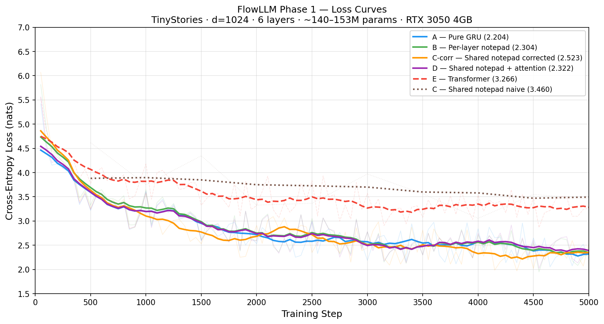

# FlowLLM — Fixed-Size Gated Memory in Recurrent Language Models

A research project characterizing fixed-size external memory ("notepad") in GRU-based language models.  
All experiments run on a single RTX 3050 Laptop GPU (4 GB VRAM).

---

## What this is

FlowLLM attaches a single shared notepad vector to a GRU language model.
The notepad is fixed-size regardless of sequence length — no KV cache, flat VRAM cost.

Phase 1 is a controlled six-variant ablation on TinyStories at 140M parameters.
The goal is one clean, reproducible finding before scaling.

---

## Phase 1 Results

| Variant | Architecture | Final Loss | vs Pure GRU |
|---|---|---|---|
| A | Pure GRU | **2.204** | — |
| B | GRU + per-layer notepad | 2.304 | +0.10 |
| D | GRU + shared notepad + attention read | 2.322 | +0.12 |
| C-corr | GRU + shared notepad (corrected) | 2.523 | +0.32 |
| E | Causal Transformer | 3.266 | +1.06 |
| C | GRU + shared notepad (naive) | 3.460 | +1.26 |

All variants: `d_model=1024`, 6 layers, `batch_size=4`, `seq_len=256`, 5 000 steps, AdamW `lr=3e-4`.

Loss curves:



---

## Key Findings

1. **GRU beats Transformer at low compute** — ~1.1 nats better at 5 000 steps on TinyStories.
2. **Naive shared notepad is catastrophic** — writing only from the last token position (3.46) is worse than a Transformer.
3. **Write mechanism dominates read mechanism** — attention read (D) still can't recover from a bad write strategy.
4. **Corrected notepad achieves parity** — every-position sequential writes bring the loss to within ~0.02 nats of pure GRU.
5. **Block-level skip connection is architecturally mandatory** — without it, gradient factor $(1-w)^{254} \approx 10^{-77}$ causes complete training failure (loss stuck at ~5.7 for 3 800 steps).

---

## Architecture

### GRUBlock (Variants A, B)
```
GRU(d, d) → LayerNorm(h + x) → MLP(4d) → LayerNorm(mlp + h)
```

### GRUNotepadBlock (Variant C-corrected)
```
all_h = GRU(x)                         # full sequence, one CUDA call
all_r = sigmoid(read_gate(all_h))
all_w = sigmoid(write_gate(all_h))
for t in range(T):
    h_read_t = LN(h_t + r_t * note)
    note     = (1 - w_t) * note + w_t * h_t
out = LN(mlp(h_reads) + h_reads)
out = LN(out + x)                       # block-level skip — REQUIRED
```

---

## Running the variants

```bash
conda activate hybrid_router
python variant_a_pure_gru.py          # Pure GRU baseline
python variant_b_per_layer_notepad.py # Per-layer notepad
python variant_c_corrected.py         # Shared notepad (corrected)
python variant_d_notepad_attention.py # Shared notepad + attention read
python variant_e_transformer.py       # Transformer baseline
```

Checkpoints are saved every 500 steps to `checkpoints/`. Loss is logged every 50 steps to `checkpoints/*/loss_log.csv`.

---

## Hardware

- GPU: NVIDIA RTX 3050 Laptop, 4 GB VRAM
- All variants fit within 4 GB with gradient checkpointing enabled
- Estimated training time: ~45–60 min per variant at 5 000 steps

---

## Status

| Phase | Goal | Status |
|---|---|---|
| 1 | Ablation: A vs B vs C vs C-corr vs D vs E | ✅ Complete |
| 2 | Task benchmarks (long-range copy, arithmetic) | Planned |
| 3 | Notepad capacity sweep (d=64/256/512/1024) | Planned |

---

## Paper

Preprint forthcoming on arXiv.  
Results and full experimental details in [`findings.md`](findings.md).
